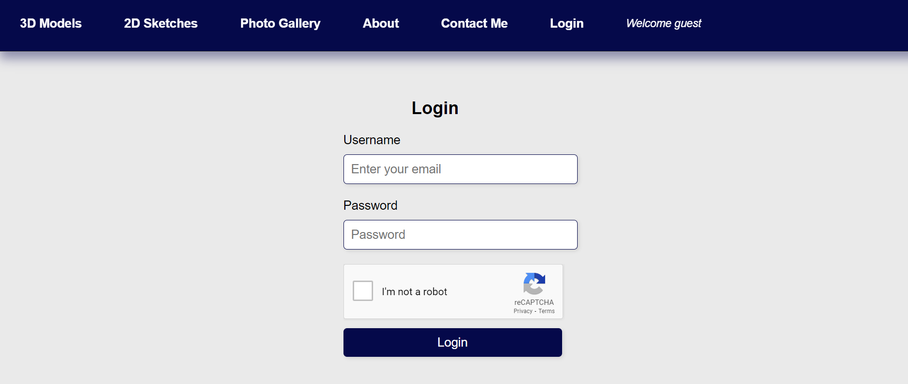

# 3D Model Viewer
## Introduction 
The 3D model viewer is just a javascript website to display the models of my son. My son Mohammed Osama created lots of 3D models using Fusion 360. He asked me to create a website for him to show up his works. I used Three.js library to load the models and show them on the html site. I mainly used javascript didn't use JQuery as the site is very simple. 

## How it is implemented
The site contains a folder with the obj models. I used javascript to load those models to the site and then rendered those models using Three.js library. 
## Challenges
### Security
* Content Security Policy (CSP): Implemented CSP to define a whitelist of trusted sources for scripts, stylesheets, and other resources, mitigating the risks of cross-site scripting (XSS) attacks.
I separated the html script from javascript files. Then I added some tursted sources for scripting such as three.js site as I need those scripts for my model viewer. Here is the code for ensuring CSP

```html
 <meta http-equiv="Content-Security-Policy" content="default-src 'self'; 
    script-src 'self' 'unsafe-inline' https://cdn.jsdelivr.net; 
    style-src 'self' https://fonts.googleapis.com; font-src 'self' https://fonts.gstatic.com">
```
* Cross-Origin Resource Sharing (CORS): the website is hotsed on github pages, CORS it's automatically configured by GitHub.
* Avoid inline JavaScript and CSS: Instead of inline scripts and styles, I use external files. For example, the following style is not recommended at all
```javascript
<script>alert('Hello, world!');</script>
```
* Error handling: Implement error handling in my JavaScript code to handle unexpected errors. 

### Sync problem in model loading.
The model takes an essential time to load especially with extensive mesh. The site has the ability to load multiple models. With many thumb images, one image for each model, you can click on the model thumb image to load it in the display area. User can click quickly and swap between models. The user can be fast enough so the current loading of the model is interrupted by a new loading of another model resulting in partially loading parts of each model !!
The scenario happens becasue apparently the browser gives the new model to a new thread, but becasue both of them are loading into the same displaly area, the problem happens. 
To solve this problem, I used mutex lock learned from Opearting Systems course. The flag is raised when a thread starts to load the model, when another thread wants to load at the same time, it can't as the flag is still raised. the second theread can only load its model only if the flag is down. the code is shown here as a reference. 
```JavaScript
        let loadingModel = false; // Variable to track whether a model is currently being loaded

        function loadModel(div, modelPath) {
            // Set loadingModel flag to true to indicate that a model is being loaded
            loadingModel = true;
            // Load the OBJ file
            const loader = new THREE.OBJLoader();
            loader.load(modelPath, function (object) {
                // Remove progress bar
                objViewer.removeChild(progressBar);
                // Load the new model
                var material = new THREE.MeshPhysicalMaterial({
                    color: 0xffffff,
                    metalness: 0.5, // Adjust as needed
                    roughness: 0.5, // Adjust as needed
                    transparent: false,
                    opacity: 0.8, // Adjust as needed
                    envMapIntensity: 1, // Adjust as needed
                    reflectivity: 0.8 // Adjust as needed
                });
                object.traverse(function (child) {
                    if (child instanceof THREE.Mesh) {
                        child.material = material;
                    }
                });
                scene.add(object);
                // Reset loadingModel flag to false after the model is loaded
                loadingModel = false;
            });
        }
```
loadingModel represents the flag. The new thread can start loading only if the flag is false.
### Modularity
I used some parts of the code from chatGPT, thanks to chatGPT as it helps me a lot !!. The problem is, the created code has a function that calls another function which in turn calls another function. The last function in this deep 3 levels should appear in in the first level, not in the third level. Becasue the third function has code that related to 3D model viewing with Three.js library which should appear in the main js file. 
To solve this problem, I put the third function in the first level, then i separted the second and third fucntions into separte js file. then I manually passed the first level function (thrid in this case) as a parmeter to the other two functions. 
```JavaScript
 constructThumbsPanel(data, thum_container,controls,loadModel);

```
In the above example, loadModel is the first level function, it was the third level before passing it a prameter throug the second level function constructThumbsPanel. 
### Header and Footer rendering
I used Handlebars to render the header and footer in all pages from two files, footer.html and header.html. You can use the following code in your project paying attention to the locations path of the css and html files 
```JavaScript
// Function to fetch partials from HTML files
function fetchPartial(url, callback) {
    var xhr = new XMLHttpRequest();
    xhr.onreadystatechange = function() {
        if (xhr.readyState === 4) {
            if (xhr.status === 200) {
                callback(null, xhr.responseText);
            } else {
                callback(new Error('Failed to fetch partial: ' + xhr.status), null);
            }
        }
    };
    xhr.open('GET', url, true);
    xhr.send();
}

// Function to render header, footer, and other content
function renderPageContent() {
    // Fetch header partial
    fetchPartial('header.html', function(error, headerHtml) {
        if (error) {
            console.error('Error fetching header partial:', error);
            return;
        }
        // Register header partial
        Handlebars.registerPartial('header', headerHtml);

        // Render header template
        var headerTemplate = Handlebars.compile('<header>{{> header}}</header>');
        document.querySelector('header').innerHTML = headerTemplate();

        // Fetch footer partial
        fetchPartial('footer.html', function(error, footerHtml) {
            if (error) {
                console.error('Error fetching footer partial:', error);
                return;
            }
            // Register footer partial
            Handlebars.registerPartial('footer', footerHtml);

            // Render footer template
            var footerTemplate = Handlebars.compile('<footer>{{> footer}}</footer>');
            document.querySelector('footer').innerHTML = footerTemplate();
        });
    });
    addCSS('css/header_footer.css');
}
// Function to add CSS style
function addCSS(cssFile) {
    var link = document.createElement('link');
    link.rel = 'stylesheet';
    link.type = 'text/css';
    link.href = cssFile;
    document.head.appendChild(link);
}

// Render header, footer, and other content
renderPageContent();

```
